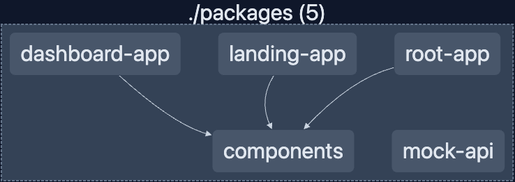
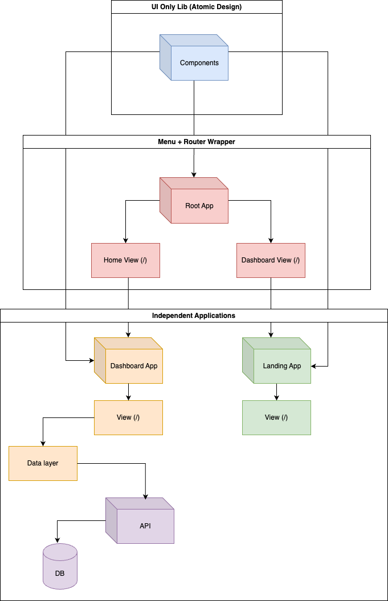
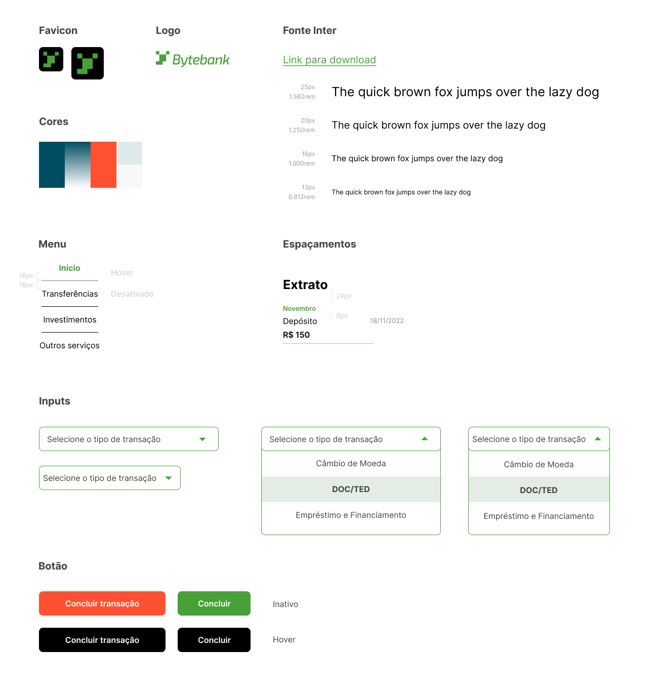

# FIAP Tech Challenge - Fase 1

Projeto desenvolvido em grupo para o segundo tech challenge da FIAP.

## Resumo

Trata-se de uma plataforma fictícia para a empresa financeira "Bytebank".
O protótipo das telas desenvolvidas pode ser encontrado no [Figma](https://www.figma.com/design/ns5TC3X5Xr8V7I3LYKg9KA/Projeto-Financeiro?node-id=503-4264&t=nhWQMyJ7ZmXNWbb6-1).

## Arquitetura do projeto

A arquitetura da segunda fase do projeto levou em consideração as decisões arquiteturais do resultado da primeira fase, tendo em vista que decidimos usar o mesmo projeto e expandir a partir dele.

A arquitetura anterior era focada em uma aplicação Next com diferentes renderizações e separação clara entre UI e dados.

Na segunda fase nós desacoplamos essa arquitetura em 4 aplicações diferentes, além da API de mocks com JSON Server.

Dentre as mudanças, nós temos:

- Biblioteca de componentes com React, MUI e Vite;
- 2 Microfrontends com Next
  - Dashboard app
  - Landing app
- Aplicação Root com Next, que consome os 2 microfrontends e adiciona uma navbar, além de controlar o roteamento

### Styleguide

Para o desenvolvimento do projeto nós seguimos o style guide proposto, porém com adaptações para seguir o [Material Design](https://m3.material.io/) e outras práticas que o grupo achou pertinente mudar.

### Demo

Video de demonstração do projeto no [Youtube]().

## Rodando o projeto

**Requisitos**

1. Tenha certeza que está usando a versão LTS do [Node.js (20.x)](https://nodejs.org/en)

   a. Recomendamos o uso do [nvm](https://github.com/nvm-sh/nvm)

   b. Caso esteja usando o nvm, antes de instalar as deps rode `nvm use` e se necessário `nvm install` e depois `nvm use` novamente.

Para instalar as deps quando já estiver utilizando a versão LTS do Node, rode `npm i` ou `npm install`.

### Ambiente de desenvolvimento local

Esse projeto é um monorepo, na pasta **packages/** estão presentes cada um dos projetos.

Por isso, recomendamos a execução dos scripts através da raíz, seja com `npm run`ou `npx lerna run`, para que seja feita a orquestração de deps e para que tenha um só terminal aberto para rodar tudo.

Os comandos de `npm run` irão seguir o package.json da raíz do projeto, bem como dos package.json dos packages específicos.
Comandos de `npx lerna run`podem rodar qualquer comando do lerna independente do package.json, isto pode ser útil para rodar um comando específico de um só projeto, por exemplo `npx lerna run dev --scope dashboard-app --scope mock-api`, para rodar só o dashboard e a api.

Exemplo:

1. Executar todas as aplicações: `npm run dev`

   a. Acompanhe a execução do Lerna nos diferentes projetos

   b. A api iniciará em [http://localhost:5000](http://localhost:5000)

   c. Os componentes serão buildados (validar se a dist está populada - packages/components/dist)

   d. O root será executado em [http://localhost:9000](http://localhost:9000)

   e. O landing app será executado em [http://localhost:3000](http://localhost:3000)

   f. O dashboard app será executado em [http://localhost:4000](http://localhost:4000)

Importante: As deps dos pacotes estão sendo orquestradas, então as aplicações só serão executadas após o build da biblioteca de componentes, já que todas a consomem.

Para buildar todas as aplicações basta executar `npm run build`.

2. Executar apenas os microfrontends, root e api: `npm run:apps`

   b. A api iniciará em [http://localhost:5000](http://localhost:5000)

   d. O root será executado em [http://localhost:9000](http://localhost:9000)

   e. O landing app será executado em [http://localhost:3000](http://localhost:3000)

   f. O dashboard app será executado em [http://localhost:4000](http://localhost:4000)

Tenha certeza de que os componentes estão buildados em seu ambiente, caso contrário, as apicações que o consomem irão quebrar.

3. Storybook e build da lib em watch mode: `npx lerna run dev:concurrently`

   a. A documentação iniciará em [http://localhost:6006](http://localhost:6006) e a lib estará buildando em watch-mode (ou seja, voce pode fazer alterações e verificar nos projetos que consomem em tempo real, caso estejam rodando)

## Tecnologias utilizadas

- [Next.js](https://nextjs.org/): Meta-framework de [React.js](https://react.dev/) para construção de aplicações completas para produção;
- [Typescript](https://www.typescriptlang.org/): Runtime para JavaScript que possibilita a tipagem estática da linguagem;
- [Material UI](https://mui.com/): Framework de UI para construção de componentes com base nos guidelines do [Material design](https://m3.material.io/) e utilização de Style-In-JS com [Emotion](https://emotion.sh/docs/introduction).
- [Vite](https://vite.dev/): Bundler para construção de aplicações, bibliotecas e outras soluções.
- [Next JS Module Federation](https://www.npmjs.com/package/@module-federation/nextjs-mf): Plugin Next para a construção de microfrontends através de [module federation](https://module-federation.io/).
- [Lerna](https://lerna.js.org/): Tecnologia para gerenciamento de monorepositórios e execução de tarefas paralelas e orquestradas através do [Nx](https://nx.dev/).
- [Amplify](https://aws.amazon.com/amplify/): Para deploy de produção da aplicação root.
- [Github Actions](https://github.com/features/actions): Para criar workflows de build e deploy para produção dos microfrontends.
- [S3](https://aws.amazon.com/s3/): Para armazenamento em nuvem dos bundles dos microfrontends.
- [Cloudfront](https://aws.amazon.com/cloudfront/): CDN em nuvem para distribuição dos arquivos de entrada dos microfrontends.
- [Docker](https://www.docker.com/): Para criar containers das aplicações.
- [Docker Compose](https://docs.docker.com/compose/): Para orquestrar a execução dos containers das aplicações.

## Conceitos aplicados

- [Design System](https://www.figma.com/blog/design-systems-101-what-is-a-design-system/): Para construção de componentes reutilizáveis e padrões de tema, cores, espaçamentos e etc;
- [MVC](https://www.geeksforgeeks.org/mvc-design-pattern/): Para separação de responsabilidades dos services e utilização de programação orientada a objetos;
- [Atomic design](https://atomicdesign.bradfrost.com/chapter-2/): Para componentização separada em categorias, possibilitando mais reutilização e semântica;
- [Colocation](https://kentcdodds.com/blog/colocation): Para organização dos diretórios e maior facilidade de trabalho;
- [Microfrontends](https://micro-frontends.org/): Execução de diferentes aplicações independentes em uma só aplicação raíz.

## Outras ferramentas úteis

- [Material Design Color Pallete](https://m2.material.io/inline-tools/color/): Para gerar a paleta de cores;
- [Adobe Color](https://color.adobe.com/create/color-contrast-analyzer): Para validar contraste;
