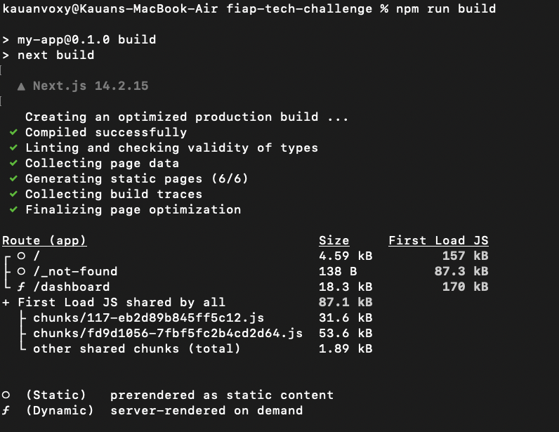

# FIAP Tech Challenge - Fase 1

Projeto desenvolvido em grupo para o primeiro tech challegne da FIAP.

## Resumo

Trata-se de uma plataforma fictícia para a empresa financeira "Bytebank".
O protótipo das telas desenvolvidas pode ser encontrado no [Figma](https://www.figma.com/design/ns5TC3X5Xr8V7I3LYKg9KA/Projeto-Financeiro?node-id=503-4264&t=nhWQMyJ7ZmXNWbb6-1).

## Arquitetura do projeto

O projeto está usando SSG para algumas views estáticas e SSR para a view de dashboard. Além disso, toda a estrutura de componentes (UI) que a view consome está usando CSR.

### Styleguide

Para o desenvolvimento do projeto nós seguimos o style guide proposto, porém com adaptações para seguir o [Material Design](https://m3.material.io/) e outras práticas que o grupo achou pertinente mudar.

### Demo

Video de demonstração do projeto:

TBD

## Rodando o projeto

**Requisitos**

1. Tenha certeza que está usando a versão LTS do [Node.js (20.x)](https://nodejs.org/en)

   a. Recomendamos o uso do [nvm](https://github.com/nvm-sh/nvm)

   b. Caso esteja usando o nvm, antes de instalar as deps rode `nvm use` e se necessário `nvm install` e depois `nvm use` novamente.

Para instalar as deps quando já estiver utilizando a versão LTS do Node, rode `npm i` ou `npm install`.

### Ambiente de desenvolvimento local

1. Front-end: `npm run dev`

   a. O client iniciará em [http://localhost:3000](http://localhost:3000)

2. Back-end (JSON server): `npm run dev:server`

   a. A api iniciará em [http://localhost:3006](http://localhost:3006)

3. Storybook: `npm run dev:storybook`

   a. A documentação iniciará em [http://localhost:6006](http://localhost:6006)

## Tecnologias utilizadas

- [Next.js](https://nextjs.org/): Meta-framework de [React.js](https://react.dev/) para construção de aplicações completas para produção;
- [Typescript](https://www.typescriptlang.org/): Runtime para JavaScript que possibilita a tipagem estática da linguagem;
- [Material UI](https://mui.com/): Framework de UI para construção de componentes com base nos guidelines do [Material design](https://m3.material.io/) e utilização de Style-In-JS com [Emotion](https://emotion.sh/docs/introduction).

## Conceitos aplicados

- [Design System](https://www.figma.com/blog/design-systems-101-what-is-a-design-system/): Para construção de componentes reutilizáveis e padrões de tema, cores, espaçamentos e etc;
- [MVC](https://www.geeksforgeeks.org/mvc-design-pattern/): Para separação de responsabilidades dos services e utilização de programação orientada a objetos;
- [Atomic design](https://atomicdesign.bradfrost.com/chapter-2/): Para componentização separada em categorias, possibilitando mais reutilização e semântica;
- [Colocation](https://kentcdodds.com/blog/colocation): Para organização dos diretórios e maior facilidade de trabalho;

## Outras ferramentas úteis

- [Material Design Color Pallete](https://m2.material.io/inline-tools/color/): Para gerar a paleta de cores;
- [Adobe Color](https://color.adobe.com/create/color-contrast-analyzer): Para validar contraste;
